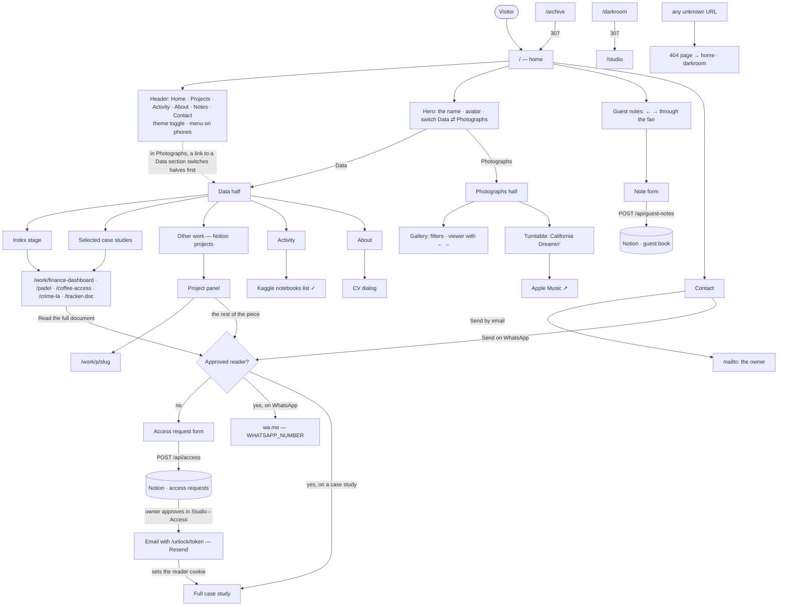
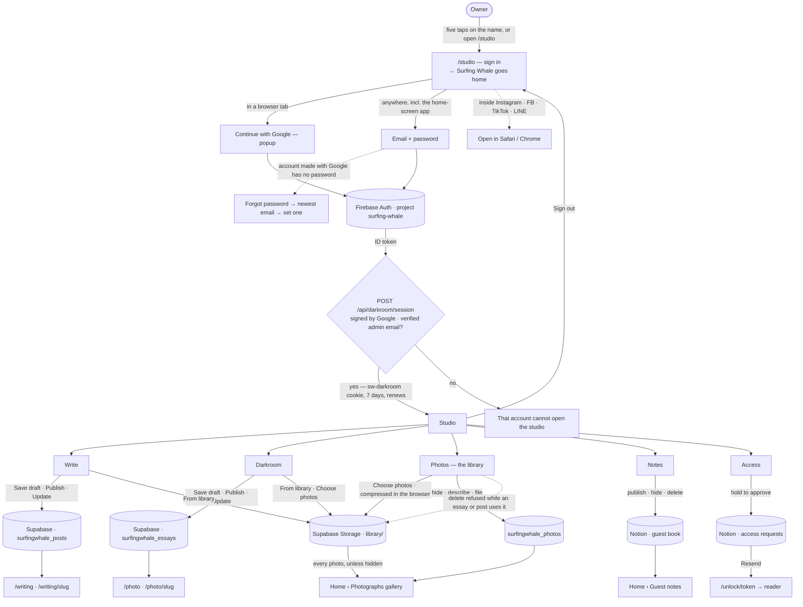

# PRD v3 — Admin mode

Status: draft · Author: Fauzy + Claude · 2026-08-25

## 1. Why

Everything on this site is either compiled into the repository or edited in
Notion. Publishing a sentence means a commit. Approving a guest note means
opening Notion and ticking a checkbox. The one exception is the darkroom,
which already writes photo essays from the site itself — and it works, which
is the reason to extend the idea rather than keep it as a one-off.

The ask: an admin mode on the site, where writing is composed in place.

## 2. What already exists

Worth being exact, because most of the foundation is built and the work here
is smaller than it looks.

| Piece | State | Where |
| --- | --- | --- |
| Password gate, HMAC cookie, rate limit | Shipped | `app/lib/darkroomSession.ts` |
| Photo upload → Cloudinary | Shipped | `app/api/darkroom/upload` |
| Essay composer (text + image rows) | Shipped | `app/darkroom` |
| Essay storage in Notion | Shipped | `app/lib/darkroom.ts` |
| Public essay rendering | Shipped | `app/photo/[slug]` |
| Guest notes capture | Shipped | `app/api/guest-notes` |
| Guest note approval | **Notion only** | `app/lib/guestNotes.ts:111` |
| Prose writing | **Missing** | — |
| Editing site copy | **Missing** | hard-coded in components |

Two things stand out. Notes are created with `Approved: false` and become
public only when the checkbox is ticked in Notion, so moderation lives
outside the product. And there is nowhere at all to publish writing that
isn't a photo essay.

## 3. Shape

One admin shell at `/studio`, with the darkroom becoming a room inside it
rather than a separate door.

```
/studio            → what needs attention: unapproved notes, drafts
/studio/write      → prose composer          → publishes to /writing/[slug]
/studio/darkroom   → the existing composer   → publishes to /photo/[slug]
/studio/notes      → approve, hide, delete guest notes
/studio/profile    → the hero's tagline and bio
```

`/darkroom` keeps working and redirects, so nothing that is already bookmarked
breaks.

### 3.1 Write

A prose composer, deliberately narrower than the photo one: a title, a
standfirst, and a body of blocks — paragraph, heading, quote, list, code,
image, and a divider. No rich-text toolbar. Markdown-ish shortcuts on a
plain textarea per block (`## ` for a heading, `> ` for a quote) beat a
toolbar for someone who writes in Notion all day.

An image inside a piece reuses the darkroom's upload path: browser-side
downscale, Cloudinary, permanent URL.

Published pieces list at `/writing` and render at `/writing/[slug]`, in the
same three-step type scale as the rest of the site.

### 3.2 Notes

Every note in one list with its state, and three actions: approve, hide,
delete. Approve flips the checkbox the API already reads, so the public
section needs no change. Email addresses are visible here and nowhere else —
the public read mapper already strips them and must keep doing so.

### 3.3 Profile

The hero's tagline and bio are strings in `HeroSection.tsx`, one pair per
mode. They move into the same Notion store, with the current values as the
fallback if the fetch fails. This is the smallest possible surface and it is
the one Fauzy will actually use most often.

## 4. Decisions

**Essays and posts live in Supabase Postgres** *(2026-10-01, were Notion)*.
`surfingwhale_essays` and `surfingwhale_posts` (supabase/surfing-whale.sql),
one row each, the blocks as jsonb, RLS on with no policies so only the
server's service-role key reaches them. Notion was storing each piece as a
chunked JSON code block and rewriting the page on every save; once photographs
were in Supabase anyway, keeping the words in a second system was the odd one
out. Projects, guest notes and access requests are still read from Notion.

**One photo library** *(2026-10-02)*. The archive room and the darkroom's
uploads were two piles of the same photographs, and the archive had a public
page of its own. Now every upload lands in one private library (the Photos
room); the darkroom and the writing room pick from it with "From library", and
a photograph reaches the site only inside an essay or a post. /archive is gone
(it redirects home). A photograph still used in an essay or a post cannot be
deleted from the library — the refusal names the pieces.

**Supabase Storage is the file store** *(2026-10-01, was Cloudinary)*. Notion's
own file URLs are signed and expire within the hour, which makes them unusable
for anything published. One public bucket, written only from the server with
the service-role key; the browser compresses first (WebP, long edge bounded,
EXIF and GPS dropped), so a phone upload is a few hundred kilobytes. Images
already on Cloudinary keep rendering.

**One session, not four** *(2026-10-01: Google sign-in, no password)*. Getting
in is a Firebase Google sign-in, per creative-hub's auth standard. The server
verifies the ID token against Google's keys for this project and checks the
verified admin email (`app/lib/adminAuth.ts`), then issues the same signed
cookie that carries the whole of `/studio`. There is no password to lose or
to guess at.

**Publishing is explicit.** Everything is a draft until a checkbox says
otherwise, and a draft's URL returns 404 rather than rendering. This already
holds for essays; writing inherits it.

**Revalidation is on-demand.** Public pages are ISR at 60 seconds today,
which means up to a minute of "did it save?". Saving should call
`revalidatePath` for the affected route so the change is visible on the next
load, with the 60-second window kept as the fallback.

## 5. Security

The gate is already server-side and stays that way. Restating what any new
route inherits, because these are the parts that are easy to lose in a
refactor:

- Every write route checks the session before it reads the body.
- Sign-in is a Google-signed token for this Firebase project with the admin's
  verified email; nothing else is accepted, so there is nothing to guess.
- A missing `DARKROOM_SECRET` signs with a per-boot random value, so a
  misconfigured deployment fails closed instead of using a guessable key.
  (This said `ADMIN_SECRET` until 2026-10-02; the code has always read
  `DARKROOM_SECRET` — see §10.)
- Everything from the browser is re-validated on the server before it reaches
  Notion, including that image URLs point at our own bucket.
- `/studio` is `noindex`, and admin routes never appear in the sitemap.

The in-memory rate limiter that guarded the password is gone with the
password.

## 6. Quality bar

The admin surfaces meet the same bar as the public ones, which the site now
passes and which was measured rather than assumed:

- One visible focus ring on every control, on `:focus-visible` only.
- A skip link as the first tab stop.
- No interactive target under 24×24px.
- Dialogs trap Tab, close on Escape and hand focus back to their trigger.
- Submit buttons stay enabled and name the field that is missing, rather than
  greying themselves out.
- Every form field carries a label and an `autocomplete` value.
- Motion is opt-in under `prefers-reduced-motion`.

## 7. Phases

**Phase 1 — Notes — shipped.** The Notes room in `/studio`: publish, hide,
delete, with a confirmation on delete. The loop that ran through Notion is
closed — a note left on the site is published from the site.

**Phase 2 — Write — shipped.** Block composer with Notion's markdown
shortcuts, `/writing` index, `/writing/[slug]`, images through the existing
upload path.

**Phase 3 — Shell — shipped in part.** `/studio` holds Write and Darkroom
behind one session; `/darkroom` redirects into it. Still to do: a landing
view showing what needs attention.

**Phase 4 — Profile (two hours, next).** Hero tagline and bio from the store, with
the current strings as fallback.

**Phase 5 — On-demand revalidation — shipped.** Saving or deleting an essay,
a post or an archive frame revalidates its public pages and the home page.

## 8. Non-goals

- More than one author, roles, or permissions.
- Comments, likes, or any social layer beyond the guest notes that exist.
- A rich-text WYSIWYG. Blocks and keyboard shortcuts, or nothing.
- Scheduled publishing.
- Analytics inside the studio; Vercel already has them.
- Editing the case study, which is prose in a component and belongs in the
  repository where its diff is reviewable.

## 9. Open questions

1. Should `/writing` sit in the main navigation, or stay reachable only from
   the darkroom the way photo essays currently are?
2. Do guest notes need an email reply from inside the studio, or is knowing
   the address enough?
3. ~~Is one password enough?~~ Answered 2026-10-01: Google sign-in.

## 10. Environment variables

Every `process.env` the app reads, what happens without it, and whether it is
actually set on the production deployment. **Values live in Vercel and
nowhere else** — this table carries names and states only, because the
repository is public.

"Set on prod" was read from the live deployment's own health endpoints on
2026-10-02, not assumed: `/api/access` reports `notionConfigured`, `gate` and
`gateBlockedBy`; `/api/darkroom/session` reports `configured`, `notion` and
`storage`. The MCP token this session has cannot list project env vars (403),
so anything those endpoints do not cover is marked **unverified** rather than
guessed at.

*Update 2026-10-02, later:* the names and targets below were then read with
`vercel env ls` from a linked checkout — names and environments only, no
value was decrypted. Rows marked "listed" are confirmed present on
Production and Preview; rows marked "unset" are confirmed absent.

### 10.1 Required — the gate and the studio stop working without these

| Variable | Without it | Set on prod |
| --- | --- | --- |
| `DARKROOM_SECRET` | Cookies are signed with a per-boot random value, so every session dies on the next request. The access gate refuses to switch on (`gateBlockers`). | ✅ (`gateBlockedBy: []`) |
| `NOTION_API_KEY` | No projects, no guest notes, no access requests. | ✅ |
| `NOTION_ACCESS_DATABASE_ID` | Access requests are not recorded; the gate refuses to switch on. | ✅ |
| `NOTION_GUESTBOOK_DATABASE_ID` | Guest notes return `{notes: [], configured: false}` — an empty guest book, not an error. | ✅ (3 approved notes live) |
| `SUPABASE_URL` (or `NEXT_PUBLIC_SUPABASE_URL`) | No essays, posts, or photo library. | ✅ (`storage: true`) |
| `SUPABASE_SERVICE_ROLE_KEY` | Same. This is the only key that reaches rows behind RLS — server only, never `NEXT_PUBLIC_`. | ✅ |

### 10.2 Switches and optional

| Variable | Default | Effect | Set on prod |
| --- | --- | --- | --- |
| `ACCESS_GATE` | unset → open | Must be the literal string `on`. Anything else — including `approval` or `true` — leaves the gate open and everything readable. | ✅ `on` (live reports `gate: "approval"`, which is the *reported* state, not the variable's value) |
| `WHATSAPP_NUMBER` | none | The WA button returns **503** to an approved reader. Digits only, no `+`. | ✅ set 2026-10-02, Production and Preview (Fauzy chose the original number; see §11.1 item 2). The Access room warns if it ever goes missing |
| `RESEND_API_KEY` + `MAIL_FROM` | none | Approval emails do not send. Approving still works and the studio shows the link to send by hand, so this is a convenience, not a dependency. Both are needed; one alone does nothing. | ✅ listed (values not checked; the Access room shows `mailConfigured`) |
| `ADMIN_EMAIL` | `fauzymuhamad43@gmail.com` | Which verified Google account may enter `/studio`. | unset — the fallback is the right address |
| `NOTION_DATABASE_ID` | a default id in `notionIds.ts` | The projects database. | ✅ (`notion: true`) |
| `SUPABASE_BUCKET` | `surfing-whale` | Storage bucket name. | unset — the default is right |
| `NEXT_PUBLIC_SITE_URL` | `https://surfing-whale.vercel.app` | The host written into approval links. **Must be changed the day a custom domain lands**, or approved readers get links to the old host. | ✅ listed (value not checked) |
| `SYNC_SECRET` | `""` | Guards `/api/sync-images`. Empty means the route **refuses every request** — it fails closed since `3512d72`; before that it fell back to `"dev-secret"`. | ✅ listed, Production and Preview (set 2026-10-01) |

### 10.3 Client-side (`NEXT_PUBLIC_*`) — these ship to every visitor

`NEXT_PUBLIC_FIREBASE_API_KEY`, `NEXT_PUBLIC_FIREBASE_APP_ID`,
`NEXT_PUBLIC_FIREBASE_PROJECT_ID`, `NEXT_PUBLIC_SIGN_IN_HOST`.

All four have hardcoded fallbacks in `app/lib/firebaseConfig.ts`, so the
sign-in works whether or not they are set. That is deliberate and safe: a
Firebase web API key is a public project identifier, not a credential — what
actually protects `/studio` is the server verifying a Google-signed ID token
against this project *and* checking the verified email (`app/lib/adminAuth.ts`).
Nothing is gained by hiding them and a broken sign-in is lost by getting them
wrong.

`NEXT_PUBLIC_SIGN_IN_HOST` is the one to watch: it names the host Google
redirects back to. A custom domain means changing it here *and* in the
Firebase console's authorised domains.

### 10.4 Build and tooling only

`SW_FONT` (`scripts/generate-brand-assets.mjs`), `NEXT_PUBLIC_BASE_URL`
(`scripts/syncs-images.ts`), `NODE_ENV`. Nothing on the site reads these at
runtime.

## 11. Pending

Everything known to be unfinished, in the order it costs something.

### 11.1 Blocked on Fauzy

1. ~~**`WHATSAPP_NUMBER` is not set.**~~ Set 2026-10-02 on Production and
   Preview, to the original number — Fauzy's choice, made knowing item 2.
2. **The old WhatsApp number is in public git history.** It was a client-side
   const from `d33b890` until `f8fc9c8` moved it server-side. Removing it from
   the shipped bundle does not remove it from the commits, and the repository
   is public. The only real fix is a different number; rewriting history on a
   public repo is worse than the problem.
3. **`public/work/maps/indonesia-nik-provinsi.html` is an orphan** — 102KB,
   referenced by no page. Delete, or give it a page. (The poster next to it,
   `isochrone-tomoro-poster.jpg`, *is* used, by the hero.)
4. **The epub → Indonesian → PDF job for ElevenLabs** has never had its file.

### 11.2 Decided but not built

5. **Phase 3 is shipped in part.** `/studio` still has no landing view saying
   what needs attention — pending notes, drafts, pending access requests. It
   opens straight into a room.
6. **Phase 4 — Profile — not started.** The hero's tagline and bio are still
   strings in `HeroSection.tsx`.
7. ~~**Nothing reports WhatsApp or mail configuration to the admin.**~~ Done
   2026-10-02: `/api/studio/access` returns `whatsappConfigured` beside
   `mailConfigured`, and the Access room says when the number is missing. Not
   on `/api/darkroom/session` as first suggested — that route answers anyone,
   signed in or not, so it is the wrong place to describe the setup.

### 11.3 Verification gaps

8. **Safari/WebKit has never been tested.** Every measurement in this repo —
   contrast, the chrome effect, overflow, headings — was taken in Chromium.
   The session's proxy blocks the WebKit download, so this cannot be closed
   from here. The chrome effect is the live risk: it was already rebuilt once
   because SMIL `gradientTransform` does not animate in WebKit, and the rAF
   loop that replaced it is the thing that has never been seen on a real
   Safari.
9. ~~**`scripts/verify-headings.mjs` still checks `/archive`.**~~ Done
   2026-10-02: it checks `/photo` and `/writing` and asserts the `/archive`
   redirect on its own line.

### 11.4 Open design questions

10. **The hero typeface was never resolved.** It is Oswald — condensed — where
    the reference Fauzy sent uses a wide grotesque. Candidates offered and
    never chosen: Archivo Black, Inter Black, Figtree 900.
11. Items 1 and 2 of §9 are still open: whether `/writing` belongs in the main
    navigation, and whether guest notes need a reply from inside the studio.

### 11.5 Housekeeping

12. ~~**The repository has moved to `SurfingWhale/surfing_whale`.**~~ The local
    checkout on Fauzy's machine already points `origin` at
    `https://github.com/SurfingWhale/surfing_whale.git`; only other clones (the
    cloud session's) may still use the old owner's URL.

13. **Google sign-in inside the home-screen app waits on one Google setting.**
    Re-checked 2026-10-03 against every likely variant: the OAuth web client
    `751278619218-posj0le1fdgio4u8e68n3ik05otsh80a.apps.googleusercontent.com`
    accepts exactly one redirect URI, `https://surfing-whale.firebaseapp.com/__/auth/handler`.
    `https://surfing-whale.vercel.app/__/auth/handler` was never saved on it.
    It goes under **Authorized redirect URIs** of that client (Google Cloud
    console, project `surfing-whale`, APIs & Services → Credentials). Nothing
    to deploy afterwards: `/api/studio/google-ready` asks Google the way a
    sign-in would, and the app's Google button signs in in place the first
    time the answer is yes. Until then, on an iPhone, the app's button opens
    the studio in Safari, where Google works.

## 12. Discoverability audit — 2026-10-02

Run against a production build with `scripts/audit-seo.mjs`, which crawls from
the home page rather than taking a list of routes, because what a crawler can
reach is itself one of the findings.

This is an SEO audit, not a QA one. It would not have caught the gallery
viewer having no way out — that was an interaction defect, and no checklist of
this kind contains it. Kept separate on purpose.

### 12.1 Nothing can find this site

Three findings, and the first two are the reason the rest barely matter.

1. **`/robots.txt` is a 404**, on localhost and on production.
2. **`/sitemap.xml` is a 404.** There is no `app/sitemap.ts` and no
   `public/sitemap.xml`. §5 of this document claims "admin routes never appear
   in the sitemap", which is true only because no sitemap exists.
3. **`/photo` and `/writing` are orphans.** Both have good titles and
   descriptions, and neither appears in the home page's served HTML. The only
   link to the darkroom is inside the photography section, which renders in
   the "capture" profile mode — client state, reached by a click. No sitemap
   plus no inbound link means the entire photo-essay and writing output is
   invisible to a crawler.

### 12.2 Measured, 13 pages crawled

| Check | Result |
| --- | --- |
| Canonical tags | **0 of 13.** None anywhere on the site. |
| Schema / structured data | **0 of 13.** No `application/ld+json` at all. |
| `<html lang>` | `id` on every page, and the copy is English. Wrong for both search and screen readers. |
| Titles 50–60 chars | 3 of 9 real pages. Home is 30 (`Muhammad Fauzy — Surfing Whale`), `/work/tracker-doc` is 26, the research page is 62. |
| Meta descriptions | Present and unique on all 9 real pages. 3 outside 120–160 chars. |
| One `<h1>` per page | 4 of 9. `/work/coffee-access`, `/work/padel` and the research page each carry **two**. |
| Heading skips | None. |
| Breadcrumbs | None anywhere. |
| Image dimensions | **Far worse than first reported.** The home page serves 23 images with no `width`/`height` attribute, the research page 10, `/work/crime-la` 4, `/work/coffee-access` 1 — every image on the site, in effect. The first pass said "10, on the research page only" because it read `img.width`, which returns the *rendered* width and is non-zero for anything that has loaded. The attributes are what reserve the box, and what layout shift depends on. Corrected 2026-10-02 by `seo-crawl`. |

### 12.3 Alt text is wrong where it matters

23 images on the home page; 19 carry `alt=""`, which declares them decorative
and hides them from search and from a screen reader.

Correct for `a2.jpg`–`a7.jpg` (the screensaver frames). **Wrong** for the rest,
which are content: `finance.jpg`, `coffee.jpg`, `crime.jpg` (the work
thumbnails), `sheet-recap.jpg`, `sheet-beranda.jpg`, `coffee-1..3.jpg`,
`crime-1..3.jpg`, `approval-flow.svg`. These are the case-study exhibits and
they describe themselves to nobody.

### 12.4 Raw files are being served as pages

Four of the thirteen URLs a crawler reaches are assets linked directly from
case studies: `/work/padel/gap-map.html`, `/work/padel/isochrone-multirange.html`,
`/work/crime/harbor-map.html`, `/research/finance/executive-summary.pdf`, plus
two `.jpg` paths. Empty title, no `<h1>`, no description, no `lang`. They are
indexable thin pages carrying the site's name. Either wrap them in a page or
exclude them in the robots.txt that does not yet exist.

This is also where `public/work/maps/indonesia-nik-provinsi.html` belongs
(§11.1 item 3) — the same class of file, with not even a link to it.

### 12.5 Not measurable from here

Keywords, search intent, cannibalisation, backlinks, competitor gaps, CTR and
impressions all need Google Search Console, which is not connected. Nothing in
this section guesses at them.

## 13. Dead ends — 2026-10-02

Asked for after the photo library turned out to lead nowhere: a sweep for
anything built that a reader, or Fauzy, cannot actually get to. Measured, not
guessed — reachability was read off a production build, the data flows off the
imports.

### 13.1 Fixed in this pass

**A photograph could not reach the site on its own.** There were two routes and
both went the long way: write an essay or a post and pick the frame inside it,
or hand-edit `app/data/photography.ts` and push a commit. The gallery read that
array and nothing else. Now a frame can be published from the Photos room —
description, category, on the site. See the commit "A photograph can go on the
site on its own now".

This one had been written into a comment as if it were a decision rather than
an oversight, which is how it survived two sessions.

### 13.2 Still dead

| What | State |
| --- | --- |
| ~~`/photo` and `/writing`~~ | **Fixed 2026-10-02.** Both are in the sitemap whatever the nav decides, the darkroom has a nav entry it never had, and robots.txt exists. They still carry no inbound link until the first essay and post are published — by design, so neither lands a reader on "Nothing published yet" — which is exactly the gap a sitemap is for. |
| `app/components/ScrollVelocity` | Imported by no file. |
| `app/components/RotatingText` | Imported by no file. |
| `/api/sync-images` | Called from no file in the app — it is a tool run by hand. **Not** open: `authorised()` refuses an empty `SYNC_SECRET`, so an unset secret locks everyone out rather than letting everyone in. §13.2 claimed otherwise until 2026-10-02; that was a misreading, not a bug. |
| `public/work/maps/indonesia-nik-provinsi.html` | 102KB, linked from nothing (§11.1). |
| WhatsApp, for an approved reader | 503 until `WHATSAPP_NUMBER` is set (§10.2). The gate's promise is partly false until then. |

### 13.3 The pattern

Every one of these is the same shape: a thing that works, with no route to it.
Nothing here is broken in a way a test would catch — the pages return 200, the
components compile, the routes respond. What is missing is the link, the
button, or the sitemap entry that lets anyone arrive.

So the check worth keeping is not "does it work" but **"what can reach it"**,
which is why `scripts/audit-seo.mjs` crawls from the home page rather than
taking a list of routes. A route list would have reported `/photo` and
`/writing` as healthy.

### 13.4 After the discoverability pass — 2026-10-02

Measured on a production build with `scripts/audit-seo.mjs`, before and after.

| | before | after |
| --- | --- | --- |
| blocking findings | 9 | **0** |
| warnings | 13 | 7 |
| `/robots.txt` | 404 | ok |
| `/sitemap.xml` | 404 | ok, 9 urls |
| canonical tags | 0 of 13 | every page not excluded in robots.txt |
| pages with two `<h1>` | 3 | 0 |
| `<html lang>` | `id` on English copy | `en-GB` |

Still open, and stated rather than closed quietly: no structured data on any
page, images without `width`/`height` attributes (23 on the home page alone —
§12.2), and three raw files still linked out of case studies as if they were
pages. The last are excluded in robots.txt now, which stops them being indexed
but does not stop them being linked.

## 14. The opening — 2026-10-02

Asked for from a recording of [carterogunsola.com](https://carterogunsola.com):
a count to 100 climbing the right edge of a black screen, a monogram pinned
bottom left, and a soft-edged wipe at the end.

Built as `app/components/Intro.tsx` with the wipe changed to the thing this
site is named after: the edge is ChromeWord's `SWELL`, the same cubic the
chrome type rides along, so the curtain is a wave rather than a straight line
and it is one idea used twice rather than two.

### 14.1 The rules it is built to

An intro is the only component that can lock somebody out of a site they have
not seen yet. Three rules, all checked by `scripts/verify-intro.mjs`:

1. **It never gates the content.** The page is server-rendered underneath and
   complete before this mounts. With JavaScript off, the pre-paint script
   never adds the class, nothing is painted, and the site is simply there.
2. **It cannot get stuck.** Everything that takes the overlay away is a CSS
   animation with `forwards`, not React state. Blocked JS chunks — hydration
   never happening — still leaves a usable page. React only drives the number.
3. **Once a session, and never under `prefers-reduced-motion`.** Replaying on
   every internal navigation is how a nice intro becomes the reason somebody
   leaves.

### 14.2 Two things found by capturing frames, not by reading code

**A flash of the whole site, then black, then the site again.** The overlay was
a React component, so it arrived a hydration late — measured at 149ms on a
production build. The ink moved to `html.intro::before`, set by the pre-paint
script.

**That fix was not enough, and a phone found the rest of it.** `::before` was
still defined in the external stylesheet, and the page is render-blocked on
that file. On 4G Fauzy got **1.3 seconds of white and then the counter** — two
loading states where the reference has one. Reproduced with the stylesheet
held back 900ms: first ink at 1313ms, with white before it.

The ink is now inlined in `<head>` as `INTRO_CRITICAL_CSS`. **First ink at
25ms, zero white frames.** It cannot use `var(--fg)` — those tokens are in the
file it is racing — so it carries `#111111` and `#f0f0f0` as literals, and
case G of the checker fails if they drift from `globals.css`.

**Nothing is on a clock that starts at first paint any more.** The exit used a
fixed 1400ms delay, which on a slow connection would have fired before React
had loaded to draw the number and skipped the whole count. Everything keys off
an `.intro-out` class that React adds when the count finishes — or that a
`setTimeout` in the inline script adds after 5s if React never arrives. That
backstop lives in the HTML rather than in a chunk that can fail to load, and
React stands down if it finds the exit already run.

**The wave was invisible.** Two versions of it. First the curtain was one tall
path whose top 30% was the swell: on a 390×844 phone the solid part came to
709px, less than the viewport, so the crest had to travel off the top before
the screen was covered. Then, with the crest riding on its own body, the ink
panel was *also* sliding up — and a straight bottom edge moving at the same
speed is all anyone saw. Nothing lifts now. The ink sits still and is covered,
which is what the reference does.

### 14.3 NumberFlow

Looked at per the ask. `@number-flow/react` 0.6.2, MIT, ~36KB unpacked plus a
~60KB core, custom-element based, and it ships `usePrefersReducedMotion` and
`useCanAnimate` — it is a good library.

**Not used for the opening.** A loading screen that waits for a library to
download before it can count is backwards, and this is on the critical path of
a first visit. The rolling digits here are a 10-high column translated by
`-digit × 10%`, which is about fifteen lines and no bytes.

**Worth it where numbers change after hydration** — the guest-note fan's
`{n} / {total}` as it is swiped is the honest case. Left as a decision rather
than taken.

### 14.4 The cost, stated

For one visit per session the overlay is the largest thing painted, so it is
what LCP measures: about 2.2s of ink. That is the price of the thing asked
for. A second page in the same session, and anyone with reduced motion, pay
nothing — no overlay is rendered at all.

## 15. What measuring changed — 2026-10-02

Three entries in this document were wrong, and one piece of work was nearly
done for nothing. All three were caught by measuring the thing rather than a
proxy for it.

**`/api/sync-images` is not open.** §13.2 called it a security hole on the
strength of `const SYNC_SECRET = process.env.SYNC_SECRET ?? ""`. Five lines
below, `authorised()` returns false whenever the secret is empty — it fails
closed, and a comment in the file says so. Corrected in §10.2 and §13.2. The
mistake was stopping at the first line that looked like an answer.

**Twenty-three images "causing layout shift" caused none.** The crawler
counted images with no `width`/`height` attribute and called the count layout
shift. Measured with a `layout-shift` PerformanceObserver on a throttled
phone, the whole site came to:

```
/                                 CLS 0.0005   good
/work/crime-la                    CLS 0.0690   good   <- the only real one
/work/finance-dashboard/research  CLS 0.0005   good
/work/coffee-access               CLS 0.0005   good
```

An image inside a box CSS has already sized shifts nothing. One of thirty-eight
was real — four charts on `/work/crime-la` at three different aspect ratios,
pushing their captions. Those four now carry their pixel size: **0.0690 →
0.0005**. The other fifteen files were not touched, and `seo-crawl` now
measures CLS instead of counting attributes.

**Structured data went from 0 pages to every page.** A `Person`, the `WebSite`,
an `Article` or `ImageGallery` per piece, and a `BreadcrumbList` on the case
studies — `app/lib/schema.tsx`. Everything in it comes from something already
on the page: no ratings, no awards, no claimed employers. A schema is the one
part of a page a search engine reads as a statement of fact, so inventing
anything there is worse than leaving it empty.

The crawler reported all of it as `?` at first — it read `@type` off the top
level, and a `@graph` has none. Fixed in the skill.

`ScrollVelocity` and `RotatingText` are deleted: 20KB imported by nothing.

| | before | after |
| --- | --- | --- |
| crawler warnings | 7 | **2** |
| blocking | 0 | 0 |
| structured data | 0 of 7 pages | 7 of 7 |
| worst CLS | 0.0690 | 0.0005 |

The two warnings left are both honest and both already explained: `/photo` and
`/writing` have no inbound link until the first essay and post are published
(the sitemap covers them), and two raw image files are still linked out of
case studies.

## 16. Rhythm — 2026-10-02

Fauzy: *"nuance offset dan symmetrical spacing-nya tuh gabisa lo create ya …
design mereka punya nafas, ga bertubrukan, gadipaksa berjarak … ai kerasa
banget design yang sesek."*

He is right about the mechanism, and measuring the site located it — after
three wrong counts, which are worth recording because they are the same
mistake each time.

### 16.1 Three over-counts before one real finding

| Claimed | Actual |
| --- | --- |
| 147 distinct left edges | 53 — the first count included `<path>` and `<g>` **inside SVGs** |
| 121 rogue edges | 43 — then most of those were items in a horizontal row, which legitimately each have their own x |
| 43 rogue edges | ~0 — the rest were the bounding boxes of **rotated** avatar cards |

Every one of these was a metric that counted something adjacent to the thing
it claimed to measure, which is the same failure as "23 images causing layout
shift" in §15. The pattern: build the measurement, then check what it is
actually counting before believing it.

### 16.2 What was real

**The hero's edges were emergent, not chosen.** `grid-template-columns:
minmax(0,1fr) auto` with `place-self: center` on the name meant nothing
decided where anything sat. At 1440 the name landed at x=282 and the facts
column at x=1252, with its own children at 1255, 1258 and 1262 — five edges
inside eleven pixels.

That is the difference between an offset and a near-miss. An offset is a
column line somebody picked; a near-miss is two things that look like they
were meant to line up and did not. The eye reads the second as a mistake.

The hero is now on the same twelve columns as every other section:

| | before | after |
| --- | --- | --- |
| name | x=282, emergent | x=260 — column 3, offset on purpose |
| facts | x=1252, emergent | flush right to x=1180 — the trailing line `.frame-split` already uses |
| sentence | x=24 | x=24, unchanged |

Ragged leading edge against a flush trailing one, opposite the sentence below
it. That asymmetry is chosen. Below 66rem nothing changed — the grid only
applies where there is room for it.

**Twenty-one spacing steps were in use.** 0, 2, 4, 6, 8, 10, 12, 14, 16, 20,
24, 28, 32, 36, 40, 48, 56, 64, 72, 80, 96px. Six of them sat between 4 and
14px, which is where *grouping* is decided — and with six near-identical
options nothing groups. A reader cannot tell 6px from 8px as a signal, only as
untidiness.

48 usages collapsed: 6→8, 10→12, 14→16, 56→64. The grouping range is now
three steps: **4, 8, 12px**.

`--space-1` to `--space-6` in globals.css are the scale new work should use,
each twice the one below, because the eye reads ratio rather than difference —
the rule the layout skill states as "the gap between two groups must be at
least twice the gap inside one".

### 16.3 What was not done, and why

The other ~500 utility classes were left alone. Rewriting them to sit on six
tokens is a day of changes nobody can eyeball, for a gain no one would see.
`scripts/verify-rhythm.mjs` fails on a step used once or twice — an accident,
since nobody decides a value and uses it once — and on more than four steps in
the 4–14px range. That catches drift while it is still one line.

### 16.4 The honest part

None of this is taste. It removes the noise that makes taste hard to hear —
near-misses, accidental steps, edges nobody chose. The judgement about whether
the result has breath is still Fauzy's, and the loop that has worked all
session is him saying it feels wrong and the measurement finding where.

### 16.5 The rest of the page, and where measuring stopped helping

The other six sections were measured against the same twelve column lines.
Almost every edge that came back "off grid" was legitimate once looked at one
at a time:

| Looked wrong | Actually |
| --- | --- |
| tilted photographs at x=448, 479, 865, 896, 913 | contents of a card, positioned against the card |
| cards at x=795 | cells of a two-column sub-grid inside the content column |
| x=534 in Activity, x=550 in Contact | the second item in a row |
| x=399, 461 in Guest notes | centred text inside a card |

One was real: `p-[18px]` on the project card's caption — the only arbitrary
pixel padding in the codebase that was off any scale. Now `p-4`.

**That is the fourth over-count** (§16.1 has the first three). A fifth followed:
a checker for the layout skill's grouping ratio — *the gap between groups must
be twice the gap inside one* — matched three containers out of a page, because
most of this layout uses CSS `gap` rather than stacked margins, and reported
the hero's deliberate 696px of air as a failure.

So the metric-building stopped there. Five measurements, four of which
measured something next to the thing they claimed to. The remaining finding
came from looking at a screenshot.

### 16.6 Sections spaced by force

Every section carried the same 96px of padding, so **Activity (one row) and
About (one paragraph) were separated by the same 192px as the work section
with five projects in it.** The gap was uniform regardless of what was being
spaced, which is what "dipaksa berjarak" looks like at page scale, and it
reads as both being equally important.

Both are short and both are about the person rather than the work, so they are
one group. Consecutive `data-weight="minor"` sections now halve the gap
between them and drop the hairline that would fence them apart again:

```
work  -> activity   192px
activity -> about    64px     <- one group
about -> notes      192px
notes -> contact    192px
```

Three to one, against a rule that asks for two. The air around the pair did
not change; what changed is that it is now around the pair rather than
through it.

## 17. Why Delete really failed — 2026-10-02

The message that §11-era work put in front of the error turned out to be the
whole point of putting it there. With "Could not delete it." replaced by the
reason, the studio said:

> Find essays using a photo: **invalid input syntax for type json**

`essaysUsing()` and `postsUsing()` ask Postgres whether any published piece
still shows a photograph, with jsonb containment:

```ts
.contains("blocks", [{ type: "images", items: [{ publicId }] }])
```

supabase-js branches on the **type** of that value. A string is passed through;
an object is `JSON.stringify`d; **an array becomes a Postgres ARRAY literal**,
built with `value.join(",")`:

```js
} else if (Array.isArray(value)) {
  this.url.searchParams.append(column, `cs.{${value.join(',')}}`)
}
```

An array of objects therefore went out as, verbatim:

```
blocks=cs.%7B%5Bobject+Object%5D%7D      ->      blocks=cs.{[object Object]}
```

Postgres parsed that as jsonb and answered "invalid input syntax for type
json" — on every delete, from the day it was written.

It shipped looking correct because `.contains(column, [...])` is exactly what
the documentation shows. That form is for an array **column**. For a jsonb
column the value has to be JSON, which means handing over the string:
`.contains("blocks", JSON.stringify([...]))`.

### 17.1 The check, and proving it is one

`scripts/verify-library.sh` case H reads the query the fake Supabase actually
received and fails on `{[object Object]}`.

A test that passes before and after a fix proves nothing, so it was run both
ways: **FAIL on the old code, PASS on the new.** The first version of the
assertion passed on the broken code — it looked for `object%20Object` and the
space is encoded as `+`. Caught by running it against the bug rather than
trusting it.

A, B, C, D, E, F, G, H: ALL PASS.

### 17.2 Still open

The library shows 22 photographs with visible repeats. Those are **separate
uploads of the same picture**, not the folder duplication §16 fixed — every
upload gets four random bytes in its name, so three uploads of one file are
three different objects and nothing can tell them apart by name. Deleting them
works; there is just nothing to deduplicate.

## 18. Why the photographs were not on the site — 2026-10-02

Delete works. Fauzy's next question: the gallery still shows the five
hardcoded photographs, not his fifteen.

The answer was already on his screen: **"In the library · 15 · 0 on the
site."** Nothing had been published. Publishing is a separate act — tap a
frame, describe it, "Put it on the site" — and nothing in the library goes up
on its own.

But "0 on the site" could not tell him *which* of two things was true, and
that is the real defect:

1. nothing has been published yet, or
2. nothing **can** be, because `surfingwhale_photos` was never created.

`/api/library/list` read the details with a `try`, logged the failure to a
server console nobody reads, and returned `published: false` for every frame.
Both cases produce the same screen.

**That is the same mistake as "Could not delete it." — in the same file, two
days after fixing it.** The pattern is: a failure that is survivable gets
swallowed so the screen still works, and the reason goes to a log the only
person who can act on it will never see.

The listing now carries `details: { ok, reason }`, the room drops "0 on the
site" when the table cannot be read, and says instead:

> Photographs cannot go on the site yet — the table they live in is not there.
> Run `supabase/surfing-whale.sql` once in Supabase → SQL Editor. It is safe
> to run again if it has been run before. Uploading and deleting work without
> it.

Case I in `scripts/verify-library.sh`: the failure is reported, it names the
fix, and a healthy table reports ok. A through I: ALL PASS.

## 19. "The button isn't there" — 2026-10-02

Fauzy, after the deploy: the publish button is missing, he probably needs to
clear his cache.

**Nothing was stale.** Checked rather than assumed:

- there is **no service worker** on this site — `app/manifest.ts` says so in a
  comment — so nothing holds old JavaScript on a phone;
- `11f3ffa` was deployed and `READY` on production;
- `GET /api/library/publish` answers **405 Method Not Allowed** with
  `x-matched-path: /api/library/publish` — the route exists, it just only has
  a POST.

So clearing the cache would have changed nothing, and the real cause was
simpler: **publishing had no label on it.** Delete is a chip on every tile
that says "Delete". Publishing was an unlabelled tap on the photograph itself,
and the panel it opens sits under the whole grid. Nothing on the screen said
so. "The button isn't there" was literally true — there was no button, only a
gesture nobody had been told about.

The room now says, above the grid: *Tap a photograph to describe it and put it
on the site.*

### 19.1 What each check actually proves

`scripts/verify-studio-photos.mjs`, run both ways:

| | |
| --- | --- |
| C the room says a tap opens it | **FAILS** with the label removed. This is the fix. |
| B the panel is on screen afterwards | **PASSES** with the `scrollIntoView` removed too, even with fifteen photographs. The harness could not reproduce the panel landing off screen. |

The scroll stays — it costs nothing and a long library makes it plausible —
but it is **defensive, not demonstrated**, and both the component and the
checker say so. Claiming it as the fix would have been inventing a cause that
matched a fix I had already written.

The fake Supabase now holds **fifteen** photographs rather than eight, because
a fixture smaller than the real thing is a fixture that passes on broken code.
That change did not make B fail either, which is how the above is known.

## 20. Fifteen photographs, and the gallery still showed five — 2026-10-03

Fauzy uploaded fifteen photographs to the library, ran the SQL when asked to,
got "Success. No rows returned" — and the gallery still showed the five old
frames from the repository. He then had to ask why, again. This is the bug,
and the part of it that was ours.

**The bug was the design, not a line.** A library photograph reached the
gallery only after being opened, described and published, one at a time
(§18). Nothing in the room said that uploading was not enough, and the
fallback to the repository's five frames made "nothing published" look like
"nothing works". The owner's model — I put photographs in my library, they
are on my photography page — was the right one, and the site's was not.

**What made it worse:**

1. Each answer moved the fix one step further away instead of making it.
   "Run the SQL" was presented as the fix; the SQL only made publishing
   *possible*. "Success" then meant nothing visible, and the next answer was
   another set of instructions instead of a change.
2. `b2918e9` emptied the effect that scrolls the photo panel into view —
   `// (removed for the test)` — and shipped it. With fifteen photographs the
   panel opens below the grid, off screen, so tapping a frame appeared to do
   nothing. The one route to publishing was hidden by a test edit.
3. The status could not be checked from outside — the table is locked to the
   server, by design — so "check the studio and tell me" was handed back to
   the person who was already tired of checking.

**Fixed:**

- Every library photograph is in the gallery unless it is hidden. A row in
  `surfingwhale_photos` now only hides, describes, files or orders a frame; a
  frame with no row shows, described as "A photograph by Muhammad Fauzy"
  until it is given words of its own. The description is asked for, no
  longer required.
- Uploading and deleting revalidate the home page, so a new photograph is
  there on the next load.
- The panel scrolls into view again.
- The Photos room's missing-table notice now says what still works.

**The rule this leaves:** when the owner says "it doesn't show", the job is
to make it show and then look at the public page to see that it does — not
to explain the steps that would make it show. Verified here by the page's
own payload after deploy, not by asking.

## 21. Flow map and audit — 2026-10-03

Every page, button and direction on the site, traced and tested. Two maps —
what a visitor can do, and what the owner can do — then where each thing
lives, then what broke. GitHub draws the diagrams; in a plain editor they
read top to bottom.

### 21.1 Visitor flows



### 21.2 Owner flows



### 21.3 Where to go

| I want to… | Go to | It ends up |
| --- | --- | --- |
| Put a photograph on the site | Studio › Photos › Choose photos | Home › Photographs, straight away |
| Keep one off the site | Studio › Photos › tap it › Hide from the site | Stays in the library |
| Describe or file a photograph | Studio › Photos › tap it | The gallery's alt text and filter |
| Write a post | Studio › Write › New › Publish | `/writing/<slug>` |
| Make a photo essay | Studio › Darkroom › New › Publish | `/photo/<slug>` |
| Publish a guest note | Studio › Notes | Home › Guest notes |
| Let someone read a case study | Studio › Access › hold Approve | They get an email link |
| Get into the studio | `/studio`, or five taps on the name | Sign-in screen |
| Change a variable | Vercel › surfing-whale › Settings › Environment Variables | §10 |
| Run the database script | Supabase › SQL Editor › `supabase/surfing-whale.sql` | Safe to run again |

### 21.4 What the audit found

Run against the live site with a scripted browser (desktop 1440 and phone
390): every link followed two levels deep and its status read, every anchor
checked against the page it is on in each half, every button pressed and its
result asserted. The studio was driven signed in, locally, with its API
answered by fixtures — signing in on production needs the owner's Google
account. About ninety checks. Anything that would write real data — a guest
note, an access request, an approval email — had its form opened, not sent.

| # | Finding | Where | State |
| --- | --- | --- | --- |
| 1 | The opening overlay returned to its resting frame after it finished — the 100 and the wave's crest over the bottom sixth of every screen, at z 9999, for about two seconds, until a backstop swept it again. It covered the access-request form in the project panel. | `Intro.tsx` | **Fixed** `11d2ca2`, verified live |
| 2 | In Photographs, Projects · Activity · About and the skip link pointed at sections only the Data half has: four dead links. | header, `page.tsx` | **Fixed** `11d2ca2` — they switch halves, then scroll |
| 3 | The project panel was a plain `div`: not announced as a dialog, focus left behind the backdrop. | `Projectmodal.tsx` | **Fixed** `11d2ca2` — role, aria-modal, focus in and back |
| 4 | Library photographs never reached the gallery (§20); the photo panel opened off screen. | Photos room, gallery | **Fixed** `92db0b8` |
| 5 | Kaggle notebook "EDA & Prediction of Los Angeles Crime" is a 404 — every slug variant 404s, so it was taken down, not renamed. | Activity, `/work/crime-la` | **Fixed** — both now link the notebooks list, `kaggle.com/muhammadfauzy43/code`; the case study says the original is no longer public |
| 6 | Google sign-in from the home-screen app is off until the site's redirect URI is accepted. | §11 item 13 | **Open** — Google Cloud console |
| 7 | Safari / WebKit has never been driven by a test; every check above is Chromium. | §11 item 8 | **Open** |
| 8 | The same photograph was in the library more than once — IMG_1304 three times (1500×2000 ×2, 1800×2400), IMG_8206 twice — none byte-identical, so storage could not tell. | gallery, `photos.ts` | **Fixed** — the gallery shows one per camera file name and aspect ratio, the largest; hiding any copy hides it. Files untouched; the studio still lists every copy |

Passed, and worth knowing they were checked: theme toggle; every header
link in the Data half (Contact stops 242px from the top because it is the
last section); the name and avatar; all five Index rows; all three Notion
folders open their panel and close on Escape; CV opens; the guest-note fan
both ways and its form; Contact's empty-form message, its mailto, and the
access gate for an unapproved reader; the mode switch mounting and
unmounting the gallery and turntable; filters; the viewer's next and close;
play and pause; "Show how it was made" and the access gate on three case
studies; the phone menu; five taps to `/studio`; the sign-in screen and its
way home; `/darkroom` and `/archive` redirects, the 404, sitemap and robots;
nine studio APIs refusing a request with no session (401); and in the
studio, all five rooms, publish refusing a missing title, unsaved-change
marking, save draft, the library picker in both editors, the photo panel in
view, hide, the in-use delete refusal, the WhatsApp warning, sign out. No
JavaScript errors on any page tested.

Three failures in the first pass were the test, not the site — a panel with
no `role="dialog"` was not recognised (that became finding 3), and the
phone menu's state was read before it closed. Each was re-checked by
screenshot before being ruled out.

## 20. The record starts at the opening — 2026-10-04

Asked for: play the song from the intro, thirty seconds forward, more than
the current option.

### 20.1 The constraint, stated rather than worked around

**A browser will not play sound without a tap.** iOS Safari has no exception;
Chrome allows it only with user activation or a high media-engagement score.
So "play it during an automatic intro" is not available, and the alternative
to asking is silence, not autoplay.

This was **not measurable here.** Headless Chromium does not enforce the
policy — checked, including with `--autoplay-policy=user-gesture-required`,
which changed nothing: audible `play()` was ALLOWED with no gesture in both
runs. The button exists because of the platform rule, reasoned from the rule
and not from a measurement, and `scripts/verify-sound.mjs` says so in its
header rather than implying it tested something it could not.

### 20.2 What was built

**An offer, not a gate.** A pill in the opening's bottom-right: *Play the
record*. Untapped, the opening runs exactly as it did, silently, and nothing
waits for it. It outlives the overlay by design — the opening is over in 2.2
seconds, which is not enough time to notice a control, read it and decide, so
the pill stays nine seconds, across the sweep and onto the page, then goes.

**The deck belongs to the page now**, not to the gallery. `Turntable` moved to
`app/lib/turntable.ts` with a module singleton. It used to be constructed
inside `VinylPlayer` and closed on unmount — fine when the gallery was the only
place sound happened, wrong once the opening can start the same record.

That is the part worth having: tap at the opening, scroll three screens, and
the turntable beside the photographs is **the same side still turning**, at the
place it has got to — not a second needle on a second copy.

### 20.3 Proven, including the counter-case

`scripts/verify-sound.mjs`:

| | |
| --- | --- |
| the opening offers the record | PASS |
| the tap starts it | PASS |
| **the preview is fetched once, not twice** | PASS — and **FAILS at 2 fetches** against the old per-component deck, checked by putting it back |

Nothing else moved: verify-intro ALL PASS, verify-contrast 76/77 nodes 0 below
AA in both themes, verify-headings 6/6, verify-chrome-effect 11/11,
verify-rhythm ALL PASS, audit-seo 0 blocking.

### 20.4 Still Apple's preview

Thirty seconds, Apple's own asset, used the way Apple provides it — to sample
a track and point at the full one. The full song is not hosted here and will
not be; it is not ours to host.

## 22. The guest book opened under a pile of guest notes — 2026-10-05

Reported with one screenshot from a phone: the card that asks for a note had
opened magnified, its wordmark cropped and the send button off the right edge,
with a guest-note card sitting on top of the name field. Two faults, with
nothing in common but the screen they landed on.

### 22.1 The fan's z-indexes were never scoped

`NotesFan` deals its cards with `zIndex: 100 - away * 10`. Inside a fan those
numbers mean "this card is in front of that one". They were being read against
the whole document, where the dialog that asks for a guest note sits at z-50 —
so the front guest-note card outranked the form by fifty.

Measured at 390×844 with three notes on the page: **1638 of 4130 sampled
points on the open card, 40% of it, were painted by something outside the
dialog** — the name field and the send button among them.

The fix is one word: `isolate` on the fan's track. A stacking context of its
own means the fan's bookkeeping stays the fan's business. Same measurement
after: 0 of 4189.

### 22.2 The card arrived zoomed because its fields were 13px

Safari on iOS zooms the page when a field under 16px takes focus. This card
focuses the name field 60ms after it opens, so it zoomed before anybody had
typed anything — and a zoomed page is exactly the screenshot that was sent:
cropped wordmark, button past the right edge.

This is a platform rule, not something measured here. Headless Chromium does
not zoom, so `verify-guest-note.mjs` reads the font size and trusts the rule,
and says so in its header rather than implying it reproduced the zoom.

The same 13px field is in `AccessGate` and `ReadMoreGate` — all three are now
16px. That is the whole fix; there is no way to be under 16px and not zoom.

### 22.3 What the checker is worth

`scripts/verify-guest-note.mjs`, on a phone viewport with notes on the page.
Put both faults back and rebuild, and it reports:

```
1638 of 4130 points on the card painted by something outside it
FAIL  A. nothing on the page paints over the open card
FAIL  B. every field is 16px or more (iOS will not zoom)
FAIL  C. the form is further from the heading than the heading is from its copy
```

Check C caught a third thing while it was there: the gap between the heading
group and the form was 12px while the gap inside the heading group was 8px.
Two groups one third further apart than the lines inside one group do not read
as two groups. Now 24px.

### 22.4 The sweep that followed, and the one metric that was honest

A phone-width sweep of eight public pages found **0px horizontal overflow and
0 pieces of text crowding the gutter** — the page itself is not cramped. The
first tap-target pass reported 26 failures on the home page, and most were
nonsense: inline links inside sentences, which WCAG 2.5.8 exempts by name.
Counting them would have meant setting body copy at 24px.

Narrowed to standalone controls, two were real and both are fixed:

| control | was | now |
|---|---|---|
| hero mode switch (`Data · Photographs`) | 19px tall | 31px (`py-1.5 -my-1.5`, line unmoved) |
| footer link columns | 21px tall, 7px apart | 31px, and a little airier |

`scripts/verify-tap-targets.mjs` holds the line at 24×24 across those eight
pages, and its header records why inline links are not counted — the fifth
time a metric here over-counted, and the first one written with the exemption
in it from the start.

### 22.5 Not changed

The header still looks undimmed over the backdrop while a dialog is open. It
is only how it looks: its controls were checked with `elementFromPoint` while
the card was open and neither the theme toggle nor the menu is reachable — the
backdrop has them. Left alone.

## 23. design-directions, and what it said about this site — 2026-10-05

A new skill in `claude-config` (`feat/design-directions`): three structurally
different directions before one gets built, rendered side by side, with the
page's visual vocabulary reported as counts. Explicitly not a score — there is
no measurement in it for taste, and it says so in its own second paragraph.

### 23.1 It was validated against a control, not asserted

A deliberately generic dashboard was written to be the thing the skill is for,
and the two separate cleanly:

| | generic control | this site, `/` |
|---|---|---|
| radii | 1 distinct, on 100% of boxes | 10 distinct, top on 38% |
| type | 5 sizes, 12–28px, ratio 2.3 | 13 sizes, 11–70px, ratio 6.4 |
| gradients | 3, all the same two stops | 6, none repeated |
| most repeated signature | 6 boxes across **2 parents** | 13 boxes in **1 parent** — a list |

`/photo` has **one** surface and no card at all; `/work/crime-la` has eleven
boxes and a single radius, which is `0`. Whatever this site's problems are,
being a pile of rounded cards is not one of them.

### 23.2 Four over-counts, found before it shipped

Running it on a real page rather than the control caught every one:

- any element with a background colour counted as a card, so the commonest
  "signature" came back as *no radius, no border, no shadow, no padding* on
  **137%** of the page — a figure that cannot exist, from summing nested boxes
  against the page's own area
- a transparent `box-shadow` layer per unset utility variable made one drawn
  shadow read as five
- `9999px`, `50%` and the `3.3e7px` a clamp resolves to are one decision
- the hero's per-letter tinting reported **90** text colours; the real number
  is **11**

That is the fifth, sixth, seventh and eighth over-count in this project's
history of measuring design. The difference is that these four were found
before anyone read the output as true.

### 23.3 The one real finding about this site

Spacing. The page measures **15 distinct gaps** against a declared scale of
4 / 8 / 16 / 32 / 64 / 128 in `--space-1..6`. Checked rather than assumed —
the off-scale values were traced to their owners, and they cluster:

- the **footer** carries 3, 14 and 28 — it was written in rem (`0.875rem`,
  `1.75rem`) while the rest of the site runs on the tokens
- the **hero** carries 36 and 28
- CV and contact grids carry 20 and 40

One of them was mine, from §22 this morning: `.foot-list li + li` got
`margin-top: 0.2rem` — 3px, a number invented to offset the padding above it,
sitting beside a scale it had no reason to miss. Now `var(--space-1)`.

The rest is left alone and recorded here instead. The footer being on its own
rhythm is a decision someone could defend; what could not be defended is not
knowing it was true.

## 24. The hero, chosen out of three — 2026-10-05

The hero's typeface had been an open question for weeks: Oswald condensed
against the reference's wide grotesque. Three directions were built thin and
rendered side by side with the new `design-directions` skill, and the question
dissolved — it was never a typeface question.

### 24.1 The three

| | made of | hierarchy from | read as | at rest |
|---|---|---|---|---|
| A the name as object | type | scale | one column, down | the name, alone |
| B the logbook header | data | position and rule | a form scanned | everything |
| C the plate | image | contrast, then a card | one picture, then its label | one thing |

What the renders said, which is not what was expected:

- **A looked good at 1440.** Its fault was never the face. At 390 it left the
  bottom 40% of the screen empty, and at 1440 its three pieces sat in three
  separate corners — which is the "forced apart" the design critique in §16
  was about, measured instead of argued.
- **B read well on a phone and broke at 1440**, where `NAME` and
  `Muhammad Fauzy` ended up ~1800px apart and stopped reading as a pair.
- **C was chosen**, for one reason: it is the only one that puts the work
  before the person. For a site arguing "he does the analysis", a stranger
  should see the analysis first.

### 24.2 What it cost, stated before it was built

The wordmark: the name at 70px with a picture inlaid in its own cap box,
changing every second, taking colour when pressed. The most distinctive object
on the site. `HeroWordmark.tsx` is left in the repository, now unused.

The avatar card went with it. It and `ModeSwitch` set the same state — a swipe
and two words — so nothing is lost but a photograph of the author on the first
screen, which is the thing this direction decided not to lead with.

### 24.3 What was taken from C and what was refused

Taken: evidence first, name as its label, the serif that every other speaking
voice on this site is set in.

**Refused: the gradient.** The direction as drawn floated the card on the photo
over a black fade. Measured, its label ran at **2.23:1** against the pale half
of the map — unreadable — and the soft gradient over a photograph is the single
most applied-by-default treatment in the whole vocabulary. A real plate does
not fade into its label; it has a printed card under it. So the picture is a
picture, the card is on the page's own surface, and the type sits on the same
background as every other line on the site. Contrast after: **79 nodes, 0 below
AA, in both themes** — nothing new to check, which is the point.

The crop is named per image (`focus`), not centred: a centred cover crop on the
isochrone map at 390 landed on empty suburb and cut every branch out of the
picture.

### 24.4 The checker caught a consequence

`verify-rhythm` went from ALL PASS to **2 FAILED** after the hero changed —
`36px` and `80px` dropped to two uses each once the old hero stopped using
them. Confirmed against HEAD that the failures were new, and the right answer
was not to invent a third use: `DocPreview` went 36→32, `ProjectSection` and
`not-found` went 80→64. Back to ALL PASS.

Suite: contrast 0 below AA both themes, headings ok, rhythm ALL PASS,
tap-targets 8/8, intro ALL PASS, sound ALL PASS, guest-note ALL PASS,
chrome 11/11.

### 24.5 Open, and his to decide

`HalloSection` renders **before** `HeroSection`, and it fills the first screen.
So the plate is the second screen, and "the work before the person" is behind a
full-screen greeting. That greeting was added deliberately in another session
(`6fb33e7`) and has not been touched here. Either it moves below the plate or
the plate is not first; both are choices, and neither is mine.

## 25. The greeting becomes a pinboard — 2026-10-05

With the hero opening on evidence (§24), the greeting in front of it was a
single word on an empty screen — a full screen of nothing before any of the
work. A reference was handed over: small captioned photographs pinned at
irregular positions around a centred line, each labelled in a diary-sized note.

### 25.1 Borrowed and not borrowed

Taken: the arrangement. Pictures scattered rather than gridded, each with its
own note, around a word that holds the middle.

**Not taken: the deep red ground and the serif it is set in.** Dropping a
reference's palette in would make the first screen the one place on this site
that belongs to a different site. The plates sit on the same paper, the notes
are in the 11px uppercase at 0.14em that every other label here uses, and the
edge round each picture is a hairline — this site separates things with rules,
not with shadows.

### 25.2 Where the screensaver went

Choosing the plate for the hero cost the wordmark, and with it the slot that
kept cycling pictures. It lands here instead: six slots rather than one.

### 25.3 Two faults the checker found, one of which it nearly missed

**The stagger was a no-op.** The first version advanced each plate by
`(tick + i * 2) % frames.length`. For a two-frame list that is `tick % 2` for
every plate — all six flipped in unison, which is precisely what the comment
above the line claimed it prevented.

Worse, the first check could not see it reliably. With every plate on one
parity and a 1000ms period, the 3.4-second sample window straddled a boundary:
the test returned "identical" or "changed" depending on timing. **A test that
cannot fail consistently is not evidence**, and this one was reporting a real
fault as a flake.

Both were fixed together. One plate changes per 700ms tick in a loop round the
board, so a plate holds for about four seconds and exactly one moves at a time.
The window is now 2.5s, which must contain two changes and cannot contain six.
The checker asserts both: at least two moved, and **not all of them**.

**The overlap check measured the wrong box.** `.hallo-word` is a full-width
block, so four plates were reported "on the word" with none of them touching a
letter. It now measures the `<text>` node's own rect, which is the ink.

`scripts/verify-hallo.mjs`: six plates wide / four on a phone, none on the word,
none under the header, no note truncated, pictures move, and under
`prefers-reduced-motion: reduce` they do not — the same page, the same code,
opposite results, which is what makes that last line worth anything.

### 25.4 Captions

Every note is its photograph's own alt text cut short, from
`app/data/photography.ts`. Nothing here is invented copy about a picture nobody
looked at. At 390 a single capped line turned each one into
"A PLANK IN CILI…"; the picture can be cropped, the note cannot, so notes wrap.

Suite: contrast 0 below AA both themes, rhythm ALL PASS, tap-targets 8/8,
intro / sound / guest-note / hallo ALL PASS, chrome 11/11, SEO 0 blocking.

### 25.5 Numbering — 2026-10-05

Each plate now carries `(1)` through `(6)` directly above its frame, the
editorial convention the reference material uses.

Set in the **mono, tabular, at full ink** — not a bold sans figure. This site
already numbers things one way: the index rows, the guest-note cards, the
plate label on the hero. A bold sans `(1)` would have been a fourth numeric
voice on a page that has one. The weight comes from full `--fg` against the
note's `--fg-label` grey rather than from a heavier face, which is also why it
still measures: 85 nodes, 0 below AA, both themes.

The number sits above the frame on every plate, whichever side that plate's
note takes — when the note is above, it rides the same line after the number;
when below, the number has the line to itself.

The hidden plates are last in source order, so a phone showing four of six
reads 1,2,3,4 rather than 1,2,4,6. `verify-hallo.mjs` asserts exactly that: the
numbers read in order for however many are on screen, and each one's box ends
above its own picture's.

## 26. The brand book — 2026-10-05

A fifteen-page A4 PDF at `docs/brand/brand-book.pdf`, built by
`scripts/build-brand-book.mjs`.

### 26.1 The rule it is built on

**Nothing in it is typed from memory.** The colour values are parsed out of
`app/globals.css` at build time, the contrast ratios are computed from those
values here, and the four faces are the same `.woff2` files the site serves,
read out of `.next/static/media` and embedded. If a value in the book and a
value in the code disagree, the book is stale and says so on its last page,
with the command to fix it.

That is the only thing that makes a brand book worth keeping. One that is
hand-written drifts from the site within a month and then quietly teaches the
wrong rules.

### 26.2 It is held to its own rules

No gradient anywhere. Hairlines rather than shadows. The 11px/0.14em label
alphabet for every label and the mono tabular for every figure, including the
folios. The site's own `--space-*` scale for its margins. If the system could
not set a fifteen-page document about itself, it would not be a system.

### 26.3 What it contains

Cover, how to read it, the five decisions everything follows from, colour in
both themes with measured contrast, the four faces, the type scale and the
label alphabet, the spacing scale and the one rule about gaps, surfaces and
stacking, the six parts the site is built from, motion, pictures, **what this
site refuses**, what is checked automatically, and a colophon.

The refusals page is the one worth re-reading: every item on it was proposed,
built or nearly shipped, with the reason it was dropped.

### 26.4 Two faults found by looking at the output

- **The spacing scale was missing entirely.** The tokens live in a *second*
  `:root` block in `globals.css` and the parser sliced only the first, so the
  Space page rendered its heading over nothing. This is the failure mode of
  every generator that reads its source by offset, and only opening the pages
  caught it.
- **The folio said `07 / —`.** The total was a placeholder that was never
  filled.

### 26.5 What the PDF actually is, measured

15 pages. Chromium converts variable fonts to Type3 — glyph outlines drawn
into the file — so the book renders identically on any reader with nothing to
download. 19 `ToUnicode` maps are present, and extraction confirms it: the hex
codes `#2154a4`, `#111111`, `#fafafa` and `#76736f` all come back as text, so
the values can be copied out rather than retyped. 328 KB.

`docs/brand/brand-book.html` is the intermediate and is ignored; the script and
the PDF are what the repository keeps.

## 27. The book checks itself — 2026-10-05

"Rebuild it with this command" is not a plan when the person it is addressed to
cannot run the command. So the book no longer depends on anyone remembering.

- `npm run brand-book` builds it.
- Every build writes `docs/brand/brand-book.lock.json`: every token the book
  publishes, the contrast ratios it printed, and a content hash of each face it
  embedded.
- `scripts/verify-brand-book.mjs` compares that fingerprint against
  `app/globals.css` as it is now and fails when they have drifted, naming each
  token and both values. Proved by changing a token and watching it fail.

### 27.1 The lock found a real fault within minutes of existing

The book had been publishing **the light palette in its dark column, and the
light ratios in both halves of its contrast table.**

`app/globals.css` opens with a custom-media definition that also contains the
words `prefers-color-scheme: dark`, forty lines above the theme itself. Both
the builder and the checker indexed the *first* match and sliced the light
`:root`.

Three things are worth keeping about this:

- **Both files had the same bug, so they agreed with each other.** The check
  passed. A shared assumption between a generator and its checker cancels out
  and produces confident, matching, wrong output. Only reading the lock file by
  eye — `dark--fg = #111111` — found it.
- **The first fix did not work either.** Testing that a window "contains
  `--bg`" still matched the mixin, because a 2400-character window from it
  reaches the light `:root`. The discriminator has to be the *value*: the dark
  block is the one whose `--bg` differs from light's.
- **The build now refuses rather than publishes.** If dark `--fg` parses the
  same as light `--fg`, the script exits 2 with a message saying the book would
  print the light palette twice. That assertion costs two lines and would have
  caught this at the first build.

The corrected table also matches an independent calculation made earlier in a
separate script — 18.09 / 16.57, 8.36 / 9.52, 4.54 / 4.65, 4.81 / 7.86,
4.52 / 7.86, 7.01 / 8.51 — which is the only reason to believe either of them.

## 28. Parts A and B — 2026-10-05

Fauzy's reading of the book: strong on C through E — colour, type, spacing,
surface, components, motion, photography, refusals, checks — and missing A and
B as chapters. Brand strategy and verbal identity were present, but written as
design decisions rather than as what they are.

He is right, and his recommendation was right too: not twenty pages of logo
rules, but one layer in front of what exists. The book is now
**A Foundation → B Verbal identity → C Design system → D Governance**, 21 pages.

### 28.1 Part A did not need writing

The Testament is already his own statement, unedited, in the repository. So
Part A quotes `app/data/testament.ts` the same way the colour pages read
`globals.css` — the purpose, the belief the archive rests on, and the tension
he states himself:

> "I still want recognition. … But I do not want attention to become the
> authority that decides whether something mattered. I want meaning to exist
> before the audience arrives."

That sentence governs more of this site than any design rule, and it was
already written before any of the design decisions it explains.

A brand foundation composed about somebody by somebody else is a guess with a
letterhead. The build enforces the alternative: `sentence()` pulls a quote by
its opening words and **exits 2 if the Testament no longer contains it**, so a
quote cannot drift into a paraphrase, and the book cannot be built with his
beliefs written for him.

### 28.2 Part B is extracted, not invented

Every voice rule is paired with live copy, and the do/do-not page quotes only
real strings — "Could not reach the server.", "Add your name so I know who
stopped by.", "Anyone can write in here — a hello, a question, a correction."
Nothing was composed to make the example work.

### 28.3 One thing deliberately left blank

Who the site is for, beyond "a stranger". The page states what the copy already
assumes and then stops, marked as his to answer. Inventing an audience would
have put a stranger's assumptions into his own brand book, which is the exact
failure Part A exists to avoid.

### 28.4 A fault the render caught

One voice example printed `${esc(String(TEST_PARAS.length))} paragraphs`
literally: the line sat in a single-quoted array entry inside a template
literal, so it never interpolated. Visible only by opening the page. The
example is now three real figures from the site.

## 29. The brand on every page — 2026-10-05

Fauzy again: positioning and personality appeared once and then gave way to
twelve pages of specifications, so the thing read as a technical document.

Three changes, no new pages:

- **A spine on every page.** The site's own public line — *"A place where I can
  leave traces of the things I chose to care about."* — read out of
  `SiteFooter.tsx` so the book cannot claim a line the site does not print, and
  set at the foot of all 21 pages. Not in the label alphabet: at that length it
  truncated to `…I CHOSE TO CARE ABOU…`, the identical fault as the greeting's
  notes. A running epigraph is not a label, so it takes the serif italic and
  keeps all of its words.
- **A statement at the head of each part**, saying what that layer is for.
- **A `Why` line on every page of C and D**, naming which decision in Part A the
  page is the consequence of. Colour answers to *the work comes before the
  person*; motion to *meaning exists before the audience arrives*; the checks to
  *the measurement is the finding*.

### 29.1 Two pages were being cut and nothing said so

Adding the lines pushed `C · Colour — light` 89px and `D · Governance` 42px past
the A4 edge. A page here is a fixed box: anything past it is simply not in the
PDF. The first two readers of that file would have found a book with its
footers missing.

The build now measures every page after rendering and **exits 2 rather than
publishing** when one overflows, naming it and by how much. Proved by putting
the old swatch size back: `1 page(s) overflow A4 and would be cut: 09 +86px`.

## 30. The swipe deck comes back — 2026-10-05

Reported with a screenshot: the card you swipe to move between Data and
Photographs is gone from the hero.

It is gone because **I removed it** in §24, on the argument that the plate
direction leads with the work and a photograph of the author on that screen
walks it back. The argument was stated at the time and it was mine to make, not
mine to settle — the swipe is the thing people actually touch, and he said so.
It is back.

What is **not** back is where it used to sit. The old hero put the deck and
`ModeSwitch` at opposite ends of a `space-between` row, which rendered two
halves of one control as two unrelated objects floating beside each other —
visible in the §24 render as a card hanging in the card's own white space.

They are one control: swipe the photographs or press a word, same state either
way. So they are now one stack, `var(--space-2)` apart, with `var(--space-4)`
to the standing facts beside them — the gap between groups beating the gap
inside one, which is the page's own rule and exactly what the old placement
broke.

Suite after: tap-targets, rhythm, hallo, guest-note and intro ALL PASS;
contrast 85 nodes, 0 below AA, both themes.
